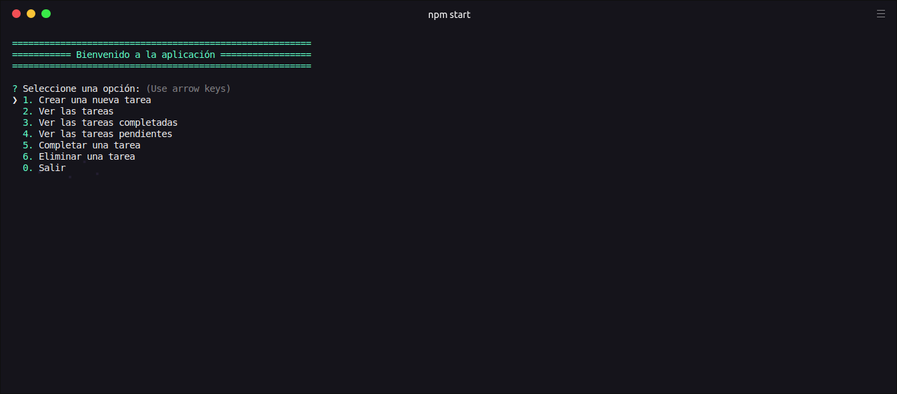

# TODO LIST NODEJS
TODO LIST con interaccion desde el terminal



## Para poder usar se debe instalar las Dependencias npm 🚀
Para instalarlo, ejecuta el siguiente comando:

```
npm install
```
o
```
yarn install
```

## Construido con 🛠️
* [UUID](https://www.npmjs.com/package/uuid) - Valores aleatorios criptográficamente sólidos
* [COLORS](https://www.npmjs.com/package/colors) - Obtenga color y estilo en su consola node.js
* [INQUIRER](https://www.npmjs.com/package/inquirer) - Una colección de interfaces de usuario de línea de comando interactivas comunes.
